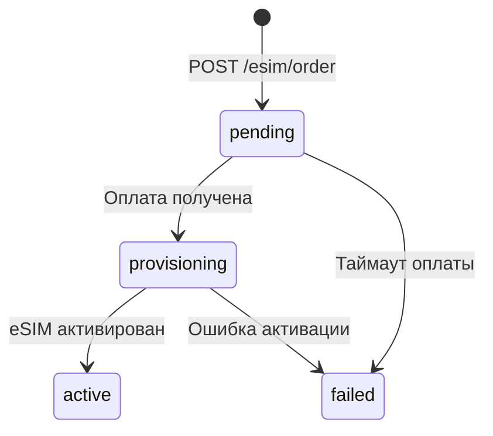

Tranzor позволяет продавать eSIM через API. Вы получаете доступ к тарифам для 150+ стран, клиент оплачивает криптовалютой, а eSIM активируется автоматически после подтверждения платежа.

## Как это работает

<Steps>
  <Step title="Получите список тарифов">
    Запросите `GET /api/v1/esim` — вы получите тарифы по странам с ценами в USD. Можно фильтровать по стране (`country=DE`) или искать по названию (`search=Germany`).
  </Step>
  <Step title="Создайте заказ">
    Отправьте `POST /api/v1/esim/order` с `planId` выбранного тарифа. В ответе вы получите `payUrl`, адреса для крипто-оплаты и `orderId` для отслеживания. Статус заказа — `pending`.
  </Step>
  <Step title="Клиент оплачивает">
    Перенаправьте клиента на `payUrl` или покажите адреса из `addresses` в своём интерфейсе. Клиент оплачивает криптовалютой (USDT, ETH и др.).
  </Step>
  <Step title="eSIM активируется автоматически">
    После подтверждения платежа система автоматически создаёт eSIM. Статус заказа меняется: `pending` → `provisioning` → `active`.
  </Step>
  <Step title="Отдайте QR-код клиенту">
    Когда `status` = `active`, в ответе `GET /api/v1/esim/{orderId}` появятся `qrcode` (LPA строка), `qrImage` (Base64 PNG) и `iosTapLink`. Клиент сканирует QR и eSIM устанавливается на устройство.
  </Step>
  <Step title="Отслеживайте использование">
    Через `GET /api/v1/esim/{orderId}` можно получить live-данные: сколько трафика осталось, сколько использовано, когда истекает.
  </Step>
</Steps>

## Статусы заказа



| Статус | Описание |
|--------|----------|
| `pending` | Заказ создан, ожидает оплаты инвойса |
| `provisioning` | Оплата получена, eSIM создаётся |
| `active` | eSIM готов — QR-код и ICCID доступны |
| `failed` | Ошибка: таймаут оплаты или сбой активации |

## Пример: полный флоу

### 1. Выбор тарифа

```bash
curl -H "Authorization: Bearer trz_your_key" \
  "https://sand.tranzor.io/api/v1/esim?country=DE"
```

```json
{
  "success": true,
  "data": {
    "countries": [{
      "country": "Германия",
      "countryIso": "DE",
      "plans": [{
        "id": "plan_de_5gb_30d",
        "dataGb": "5",
        "days": 30,
        "priceUsd": 12.50,
        "operators": "T-Mobile, Vodafone"
      }]
    }]
  }
}
```

### 2. Создание заказа

```bash
curl -X POST https://sand.tranzor.io/api/v1/esim/order \
  -H "Authorization: Bearer trz_your_key" \
  -H "Content-Type: application/json" \
  -d '{
    "planId": "plan_de_5gb_30d",
    "clientEmail": "user@example.com",
    "clientRef": "my-order-123"
  }'
```

```json
{
  "success": true,
  "data": {
    "orderId": "esim_abc123",
    "status": "pending",
    "invoiceId": "inv_xyz789",
    "payUrl": "https://pay.tranzor.io/inv_xyz789",
    "amount": 12.50,
    "currency": "USD",
    "plan": {
      "country": "Германия",
      "countryIso": "DE",
      "dataGb": "5",
      "days": 30
    },
    "addresses": [
      {
        "chain": "tron",
        "address": "TXyz...",
        "expectedAmount": "12500000",
        "isToken": true,
        "tokenSymbol": "USDT"
      }
    ],
    "expiresAt": "2025-01-01T01:00:00Z"
  }
}
```

### 3. Polling статуса после оплаты

```bash
curl -H "Authorization: Bearer trz_your_key" \
  "https://sand.tranzor.io/api/v1/esim/esim_abc123"
```

```json
{
  "success": true,
  "data": {
    "orderId": "esim_abc123",
    "status": "active",
    "plan": { "country": "Германия", "dataGb": "5", "days": 30 },
    "esim": {
      "iccid": "8949...",
      "qrcode": "LPA:1$...",
      "qrImage": "data:image/png;base64,...",
      "iosTapLink": "https://esimsetup.apple.com/esim_dep..."
    },
    "liveData": {
      "dataLeftMb": 5120,
      "dataPackageMb": 5120,
      "dataUsedMb": 0,
      "expiresAt": "2025-01-31T00:00:00Z",
      "statusQr": "installed"
    }
  }
}
```

<Note>
  Поле `esim` доступно **только** когда `status` = `active`. При других статусах оно будет `null`.
</Note>

## Параметры заказа

| Поле | Обязательное | Описание |
|------|:---:|----------|
| `planId` | да | ID тарифа из `GET /api/v1/esim` |
| `clientEmail` | нет | Email клиента — получит уведомление об активации |
| `clientRef` | нет | Ваш внутренний ID заказа (используется как `orderId` инвойса) |

## Данные eSIM (при status=active)

| Поле | Описание |
|------|----------|
| `iccid` | Уникальный ID SIM-карты |
| `qrcode` | LPA activation string — для программной активации |
| `qrImage` | Base64 PNG — QR-код для сканирования камерой |
| `iosTapLink` | Ссылка для установки на iOS в один тап |

## Live-данные

| Поле | Описание |
|------|----------|
| `dataLeftMb` | Остаток трафика в МБ |
| `dataPackageMb` | Полный объём пакета в МБ |
| `dataUsedMb` | Использовано МБ |
| `expiresAt` | Дата истечения тарифа |
| `statusQr` | Статус QR: `not_installed`, `installed`, `expired` |

## Поддерживаемые устройства

eSIM поддерживается на большинстве современных устройств:

- **iPhone** — XR, XS и новее
- **iPad** — Pro (3-го поколения и новее), Air (3-го поколения и новее), Mini (5-го поколения и новее)
- **Samsung** — Galaxy S20 и новее, Galaxy Z Fold/Flip
- **Google Pixel** — 3a и новее
