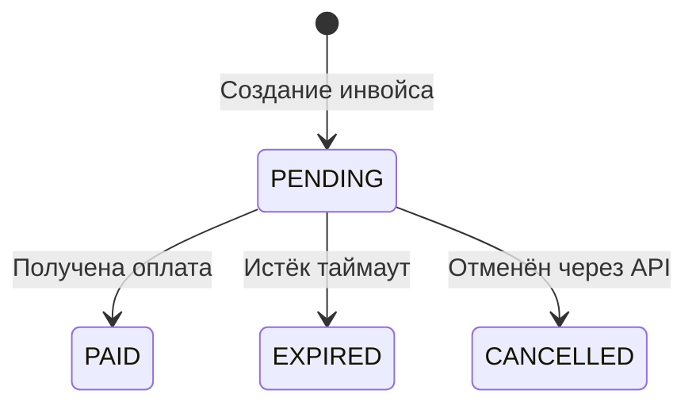

Инвойс — основная сущность Tranzor API. Он представляет платёжное требование, которое вы создаёте для клиента.

## Жизненный цикл

## Статусы

| Статус | Описание |
|--------|----------|
| `PENDING` | Инвойс создан, ожидает оплаты. Клиент может перевести средства на один из адресов. |
| `PAID` | Транзакция подтверждена в блокчейне. Средства зачислены. |
| `EXPIRED` | Время ожидания оплаты истекло. Таймаут настраивается в параметрах магазина. |
| `CANCELLED` | Инвойс отменён через API. Можно отменить только `PENDING` инвойсы. |

## Поля инвойса

| Поле | Тип | Описание |
|------|-----|----------|
| `invoiceId` | string | Уникальный ID инвойса |
| `amount` | number | Сумма в USD |
| `currency` | string | Валюта (сейчас только `USD`) |
| `status` | string | Текущий статус |
| `orderId` | string? | Ваш ID заказа |
| `description` | string? | Описание платежа |
| `metadata` | string? | Произвольные данные (до 2000 символов) |
| `payUrl` | string | Ссылка на страницу оплаты |
| `addresses` | array | Адреса для оплаты |
| `payment` | object? | Данные об оплате (заполняется при статусе `PAID`) |
| `expiresAt` | datetime | Дата истечения |
| `createdAt` | datetime | Дата создания |

## Адреса оплаты

При создании инвойса генерируются уникальные адреса для каждой поддерживаемой сети. Каждый адрес содержит:

- **chain** — название сети (`ethereum`, `tron` и др.)
- **address** — адрес кошелька
- **expectedAmount** — ожидаемая сумма в минимальных единицах
- **isToken** — является ли оплата токеном
- **tokenSymbol** — символ токена (например `USDT`)

## Данные об оплате

После перехода в статус `PAID` в поле `payment` появляются:

- **chain** — сеть, в которой прошла оплата (например `tron:USDT`)
- **amount** — полученная сумма
- **txHash** — хеш транзакции
- **paidAt** — дата оплаты
