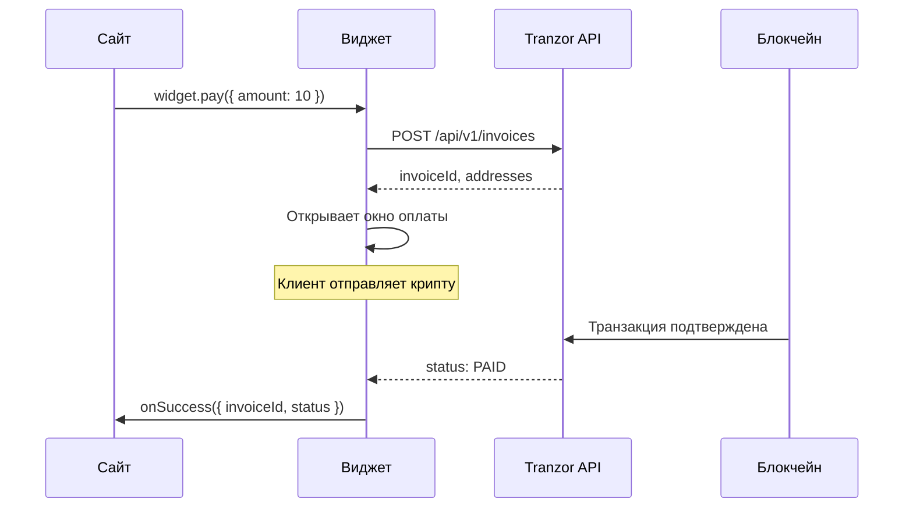

## Обзор

Платёжный виджет Tranzor — это готовое решение для приёма криптовалютных платежей на любом сайте. Виджет открывает красивое модальное окно с формой оплаты прямо на вашей странице.

**Преимущества:**
- Одна строка кода для интеграции
- Не нужен бэкенд — всё работает на клиенте
- Автоматический polling статуса оплаты
- Колбэки для обработки результата
- Поддержка всех сетей и токенов
- Адаптивный дизайн (мобильные + десктоп)

---

## Быстрый старт

### Шаг 1: Получите API ключ

Перейдите в **Личный кабинет → Эквайринг → Ваш магазин → API ключи** и создайте новый ключ.

### Шаг 2: Подключите скрипт

Добавьте скрипт виджета перед закрывающим тегом `</body>`:

```html
<script src="https://sand.tranzor.io/widget.js"></script>
```

### Шаг 3: Выберите способ интеграции

---

## Способ 1: Кнопка (без кода)

Самый простой способ — добавьте HTML-кнопку с data-атрибутами:

```html
<script src="https://sand.tranzor.io/widget.js"></script>

<button
  data-tranzor-pay
  data-tranzor-key="trz_your_api_key"
  data-tranzor-amount="10.00"
  data-tranzor-description="Оплата заказа #123"
  data-tranzor-order="order-123"
  style="background:#0097B2;color:#fff;padding:12px 24px;border:none;border-radius:12px;font-size:15px;font-weight:600;cursor:pointer"
>
  Оплатить $10.00
</button>
```

**Атрибуты:**

| Атрибут | Обязательный | Описание |
|---------|-------------|----------|
| `data-tranzor-pay` | Да | Маркер кнопки оплаты |
| `data-tranzor-key` | Да | Ваш API ключ (`trz_...`) |
| `data-tranzor-amount` | Да | Сумма в USD |
| `data-tranzor-description` | Нет | Описание платежа |
| `data-tranzor-order` | Нет | Ваш ID заказа |

<Info>
  Кнопка инициализируется автоматически при загрузке страницы. Можно добавить несколько кнопок с разными суммами.
</Info>

---

## Способ 2: JavaScript API

Полный контроль — вызывайте оплату из кода и обрабатывайте результат через колбэки:

```html
<script src="https://sand.tranzor.io/widget.js"></script>

<script>
  // Инициализация
  const widget = new TranzorWidget({
    apiKey: 'trz_your_api_key',

    // Платёж подтверждён
    onSuccess: (data) => {
      console.log('Оплата получена!', data);
      // data.invoiceId — ID инвойса
      // data.status — "PAID"
      // data.paidChain — "tron:USDT"
      window.location.href = '/thank-you';
    },

    // Ошибка или таймаут
    onError: (err) => {
      console.error('Ошибка:', err.message);
      // err.status — "EXPIRED" или "CANCELLED"
      alert('Платёж не удался: ' + err.message);
    },

    // Виджет закрыт пользователем
    onClose: () => {
      console.log('Виджет закрыт');
    },
  });

  // Вызов оплаты
  function pay() {
    widget.pay({
      amount: 25.00,
      description: 'Подписка Premium',
      orderId: 'sub-456',
      metadata: '{"userId": 42}',
    });
  }
</script>

<button onclick="pay()">Оплатить $25.00</button>
```

---

## Параметры `widget.pay()`

| Параметр | Тип | Обязательный | Описание |
|----------|-----|-------------|----------|
| `amount` | number | Да | Сумма в USD (от 0.01) |
| `description` | string | Нет | Описание платежа (видит клиент) |
| `orderId` | string | Нет | Ваш ID заказа (уникальный) |
| `currency` | string | Нет | Валюта (`USD` по умолчанию) |
| `metadata` | string | Нет | Произвольные данные (до 2000 символов) |

---

## Колбэки

### `onSuccess(data)`

Вызывается когда платёж подтверждён:

```javascript
{
  invoiceId: "cmn3abc123...",  // ID инвойса Tranzor
  status: "PAID",
  paidChain: "tron:USDT"       // Сеть и токен оплаты
}
```

### `onError(err)`

Вызывается при ошибке, истечении срока или отмене:

```javascript
{
  message: "Payment expired",  // Описание ошибки
  status: "EXPIRED"            // "EXPIRED" или "CANCELLED"
}
```

### `onClose()`

Вызывается когда пользователь закрывает виджет (кликом на фон, кнопку × или Escape).

---

## Как это работает



1. Виджет создаёт инвойс через Tranzor API
2. Открывает модальное окно со страницей оплаты
3. Клиент отправляет криптовалюту на указанный адрес
4. Виджет автоматически проверяет статус каждые 5 секунд
5. При подтверждении — вызывает `onSuccess` и закрывает окно

---

## Примеры интеграции

### WordPress / WooCommerce

```html
<!-- Добавьте в footer.php вашей темы -->
<script src="https://sand.tranzor.io/widget.js"></script>

<script>
  // Кнопка "Оплатить криптой" на странице checkout
  document.addEventListener('DOMContentLoaded', function() {
    const cryptoBtn = document.createElement('button');
    cryptoBtn.textContent = 'Оплатить криптой';
    cryptoBtn.style.cssText = 'background:#0097B2;color:#fff;padding:12px 24px;border:none;border-radius:8px;cursor:pointer;margin-top:10px';

    cryptoBtn.onclick = function() {
      const widget = new TranzorWidget({
        apiKey: 'trz_your_api_key',
        onSuccess: function(data) {
          // Обновить статус заказа на сервере
          fetch('/wp-json/wc/v3/orders/' + orderId, {
            method: 'PUT',
            body: JSON.stringify({ status: 'processing' })
          });
        }
      });
      widget.pay({
        amount: parseFloat(document.querySelector('.order-total .amount').textContent),
        orderId: 'wc-' + orderId
      });
    };

    document.querySelector('.woocommerce-checkout-payment').appendChild(cryptoBtn);
  });
</script>
```

### React / Next.js

```jsx
import { useEffect, useRef } from 'react';

function CryptoPayButton({ amount, orderId, onPaid }) {
  const widgetRef = useRef(null);

  useEffect(() => {
    // Загружаем скрипт один раз
    if (!document.querySelector('script[src*="widget.js"]')) {
      const script = document.createElement('script');
      script.src = 'https://sand.tranzor.io/widget.js';
      document.head.appendChild(script);
    }
  }, []);

  const handlePay = () => {
    const widget = new window.TranzorWidget({
      apiKey: process.env.NEXT_PUBLIC_TRANZOR_KEY,
      onSuccess: (data) => onPaid(data.invoiceId),
    });
    widget.pay({ amount, orderId });
  };

  return (
    <button onClick={handlePay} className="bg-[#0097B2] text-white px-6 py-3 rounded-xl font-semibold">
      Оплатить ${amount}
    </button>
  );
}
```

### PHP

```php
<!-- payment.php -->
<!DOCTYPE html>
<html>
<body>
  <h1>Оплата заказа #<?= htmlspecialchars($_GET['order_id']) ?></h1>

  <button
    data-tranzor-pay
    data-tranzor-key="trz_your_api_key"
    data-tranzor-amount="<?= htmlspecialchars($_GET['amount']) ?>"
    data-tranzor-description="Заказ #<?= htmlspecialchars($_GET['order_id']) ?>"
    data-tranzor-order="<?= htmlspecialchars($_GET['order_id']) ?>"
    style="background:#0097B2;color:#fff;padding:14px 28px;border:none;border-radius:12px;font-size:16px;font-weight:600;cursor:pointer"
  >
    Оплатить криптой $<?= htmlspecialchars($_GET['amount']) ?>
  </button>

  <script src="https://sand.tranzor.io/widget.js"></script>
</body>
</html>
```

---

## Настройка виджета в личном кабинете

1. Откройте **Эквайринг** → выберите магазин
2. Перейдите на вкладку **Виджет**
3. Скопируйте готовый код с вашим API ключом
4. Вставьте на ваш сайт

<Frame>
  
</Frame>

---

## Безопасность

<Warning>
  API ключ в виджете виден клиентам. Это нормально — ключ может только **создавать инвойсы** для вашего магазина. Он не даёт доступа к средствам или настройкам.

  Для проверки оплаты на сервере используйте **вебхуки с HMAC-подписью**, а не доверяйте колбэку `onSuccess` на клиенте.
</Warning>

### Рекомендации:
- Всегда проверяйте оплату на сервере через [вебхук](/concepts/webhooks) или [GET /api/v1/invoices/:id](/api-reference/endpoint/get-invoice)
- Не полагайтесь только на клиентский `onSuccess` — его можно подделать
- Используйте `orderId` для связи инвойса с заказом в вашей системе

---

## FAQ

<AccordionGroup>
  <Accordion title="Виджет работает на мобильных?">
    Да, окно оплаты полностью адаптивно. На мобильных устройствах оно занимает весь экран.
  </Accordion>
  <Accordion title="Какие криптовалюты поддерживаются?">
    Все сети и токены, настроенные в вашем магазине: TRX, USDT (TRC-20, ERC-20), TON, BTC, ETH, BNB, SOL и другие.
  </Accordion>
  <Accordion title="Сколько времени на оплату?">
    По умолчанию 60 минут (настраивается в параметрах магазина от 1 до 1440 минут).
  </Accordion>
  <Accordion title="Можно использовать на нескольких сайтах?">
    Да, один API ключ работает на любом количестве доменов. CORS настроен для всех origin.
  </Accordion>
  <Accordion title="Как стилизовать кнопку?">
    Кнопка — обычный HTML элемент, стилизуйте как угодно через CSS. Виджет использует свой дизайн.
  </Accordion>
</AccordionGroup>
